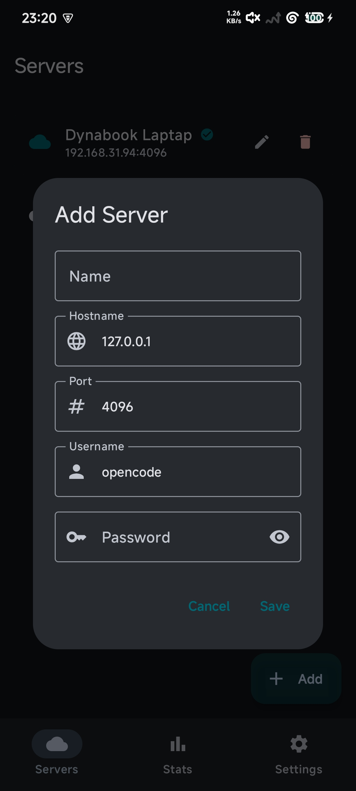
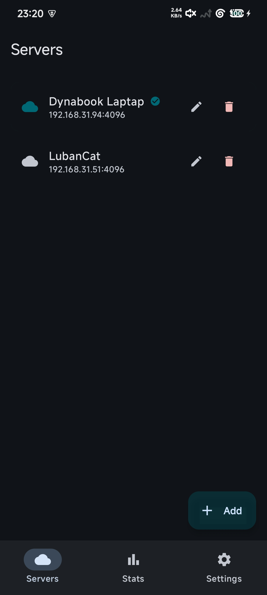
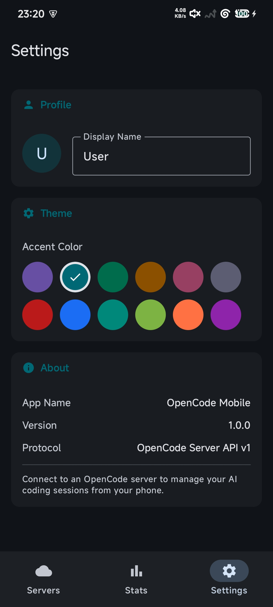
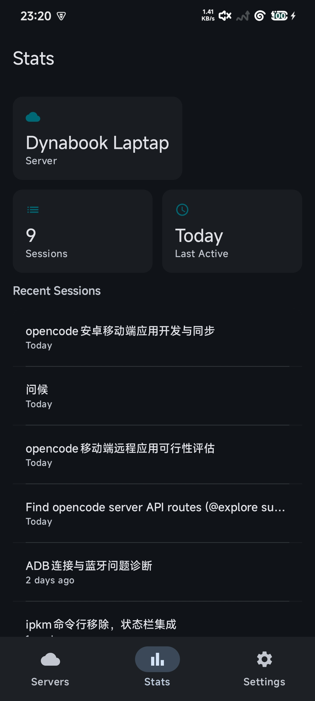
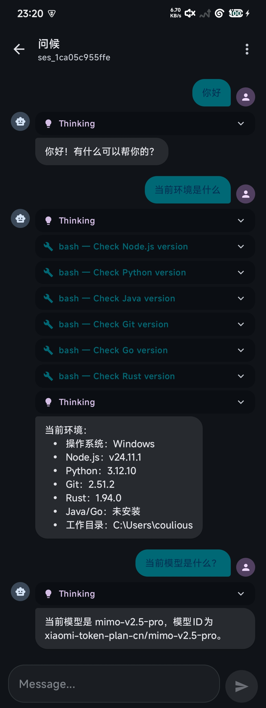

# OpenCode Mobile

OpenCode 的 Android 客户端，连接 OpenCode Server 进行 AI 编程对话。

## 功能

- 多服务器管理：保存、切换多个 OpenCode Server 连接
- 会话管理：创建、查看、删除会话
- AI 对话：发送消息，实时轮询获取 AI 回复
- 工具调用展示：折叠式显示工具名称、状态、输出
- 思考过程展示：折叠式显示 reasoning 内容
- Markdown 渲染：支持粗体、斜体、代码块、列表等
- 会话信息：查看 Todo 列表、会话详情、分享链接
- 主题色自定义：12 种 Material You 主题色可选
- 统计面板：Session 总数、最近活跃时间、最近会话列表

## 截图

<!-- TODO: 添加截图 -->
<p align="center">
  
  
  
  
  
</p>

## 前置要求

- Android 7.0+ (API 24)
- 运行中的 OpenCode Server

## 快速开始

### 1. 启动 OpenCode Server

```bash
opencode serve --port 4096 --cors http://localhost
```

如需密码认证：

```bash
OPENCODE_SERVER_PASSWORD=your-password opencode serve --port 4096
```

### 2. 安装 APK

下载 `app-debug.apk` 安装到手机，或用 Android Studio 编译运行。

### 3. 连接服务器

打开 App → 点击 `+` 添加服务器 → 输入地址和端口 → 点击连接

## 技术栈

- Kotlin + Jetpack Compose
- Material 3 + Dynamic Color (莫奈取色)
- Hilt 依赖注入
- Ktor HTTP Client
- Kotlinx Serialization
- DataStore 本地存储
- Navigation Compose

## 项目结构

```
app/src/main/java/com/example/opencode/
├── data/
│   ├── model/          # API 数据模型
│   ├── remote/         # Ktor HTTP 客户端
│   ├── local/          # DataStore 存储
│   └── repository/     # Repository 层
├── di/                 # Hilt 模块
└── ui/
    ├── chat/           # 聊天界面
    ├── server/         # 服务器列表
    ├── sessions/       # 会话列表
    ├── settings/       # 设置页面
    ├── stats/          # 统计页面
    └── navigation/     # 导航路由
```

## 编译

```bash
# Debug 包
./gradlew assembleDebug

# Release 包 (需要签名配置)
./gradlew assembleRelease
```

## API

本应用对接 OpenCode Server REST API：

- `GET /session` — 会话列表
- `POST /session` — 创建会话
- `GET /session/{id}/message` — 消息列表（支持分页）
- `POST /session/{id}/message` — 发送消息
- `GET /global/health` — 健康检查

完整 API 文档：启动 Server 后访问 `http://<host>:<port>/doc`

## License

MIT
